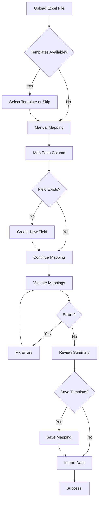

# Dynamic Excel Upload System Guide

## Overview

The enhanced Excel upload system now supports fully dynamic field mapping, allowing you to import ANY spreadsheet format without requiring specific column names. The system adapts to your data instead of forcing your data to fit a rigid structure.

## Key Features

### ✅ 1. Automatic Column Detection
- Upload any Excel (.xlsx) or CSV file
- System automatically reads all column headers
- Shows preview of first 10 rows for verification

### ✅ 2. Dynamic Field Mapping UI
- **Two-column interface:**
  - Left: Your Excel column names
  - Right: Dropdown to map to database fields
- **Options:**
  - Map to existing standard fields
  - Map to custom fields
  - Create new fields on-the-fly
  - Skip/ignore columns you don't need

### ✅ 3. Custom Field Creation
- **Create fields directly from upload:**
  - Click "Create new field" in the mapping dropdown
  - Define field name, label, and type
  - Set as required or optional
  - Add default values
- **Field types supported:**
  - Text
  - Number
  - Date
  - Yes/No (Boolean)
  - Email
  - URL

### ✅ 4. Saved Mapping Templates
- **Save your mappings for reuse:**
  - After mapping, check "Save as template"
  - Name your template (e.g., "Item Cache Template")
  - Add optional description
  - Templates appear on future uploads
- **Load saved templates:**
  - Upload file → Choose template → Import
  - One-click imports for recurring formats

### ✅ 5. Flexible Validation
- **Errors vs Warnings:**
  - Errors: Missing required fields, duplicate mappings
  - Warnings: Unmapped columns (won't stop import)
- **Import continues even with warnings**
- **Clear summary before import**

### ✅ 6. Custom Field Manager
- **Dedicated management interface:**
  - View all custom fields
  - See field properties (type, required, default)
  - Delete unused fields
  - Create new fields anytime

## How to Use

### Standard Upload Process

1. **Navigate to Inventory → Item Cache Inventory or Boxes**
2. **Click "Upload Excel"**
3. **Select your Excel/CSV file**
4. **Map your columns:**
   - Each Excel column shows a dropdown
   - Select matching database field
   - Or click "Create new field" if needed
   - Or select "Skip column" to ignore
5. **Review warnings and errors**
6. **Optionally save as template**
7. **Click "Import Data"**

### Creating Custom Fields

#### During Upload:
1. In the mapping step
2. Find the Excel column you want to map
3. Click "Create new field for [column name]"
4. Fill in field details
5. Field is immediately available for mapping

#### From Field Manager:
1. Navigate to Inventory → Custom Fields tab
2. Choose table (Cache Inventory or Boxes)
3. Click "Add Custom Field"
4. Configure field properties
5. Field is available in future uploads

### Using Templates

#### Save a Template:
1. Complete field mapping
2. On confirmation screen, check "Save as template"
3. Enter template name and description
4. Import as normal
5. Template saved for future use

#### Load a Template:
1. Upload file
2. System shows "Load Saved Template" screen
3. Click "Use" on your template
4. Mappings auto-applied
5. Review and import

## Field Storage

### Standard Fields vs Custom Fields
- **Standard fields:** Built-in database columns (e.g., `barcode`, `description`)
- **Custom fields:** Stored in `custom_data` JSONB column

### Benefits of Custom Fields:
- No database migration needed
- Add/remove fields instantly
- Perfect for agency-specific data
- Flexible schema evolution

## Import Data Flow



## Best Practices

### For Agencies/Organizations:
1. **Create templates for each spreadsheet format**
   - Cache Format
   - Box Inventory Format
   - Equipment Format
2. **Document required fields**
3. **Train staff on one template**
4. **Share templates across team**

### For Data Quality:
1. **Use required fields sparingly** - only truly critical data
2. **Set sensible default values** - reduces errors
3. **Choose correct field types** - enables validation
4. **Preview before import** - verify data looks correct
5. **Start with small test files** - validate process first

### For Custom Fields:
1. **Use clear, descriptive names**
2. **Add field descriptions** - helps future users
3. **Clean up unused fields** - keep schema tidy
4. **Consider field types carefully** - harder to change later

## Database Schema

### Tables Modified:
- `cache_inventory` - Added `custom_data` JSONB column
- `cache_boxes` - Added `custom_data` JSONB column
- `mapping_templates` - Stores saved field mappings
- `custom_fields` - Tracks custom field definitions

### Custom Data Structure:
```json
{
  "custom_field_1": "value",
  "custom_field_2": 123,
  "custom_field_3": "2024-01-15"
}
```

## Troubleshooting

### "Missing required fields" error
- Check which fields are marked required
- Ensure you've mapped all required fields
- Consider if field truly needs to be required

### "Duplicate mappings detected"
- You've mapped multiple Excel columns to same database field
- Review mappings and fix duplicates
- Each database field can only receive data from one column

### Template won't load
- Ensure you selected correct table type
- Template saved for "Cache Inventory" won't work for "Boxes"
- Re-map manually if template incompatible

### Custom field not appearing
- Refresh the page
- Check you're on correct table tab
- Verify field was created successfully

### Import succeeds but data missing
- Check if columns were marked "Skip"
- Review mapping confirmation screen
- Verify data existed in original Excel file

## Technical Notes

### Performance:
- Imports processed in batches of 100 records
- Large files (>1000 rows) may take 10-30 seconds
- Progress bar shows import status

### Data Types:
- Text fields: Any string value
- Number fields: Integers and decimals
- Date fields: ISO format (YYYY-MM-DD) preferred
- Boolean fields: true/false, yes/no, 1/0 all accepted

### Limitations:
- Maximum file size: 20MB
- Maximum 1000 custom fields per table (practical limit)
- Custom fields stored as text in JSONB (type conversion on read)

## Support

For issues or questions:
1. Check this guide first
2. Review validation errors carefully
3. Test with small sample file
4. Check Custom Fields tab for field definitions
5. Verify template mappings in confirmation screen
